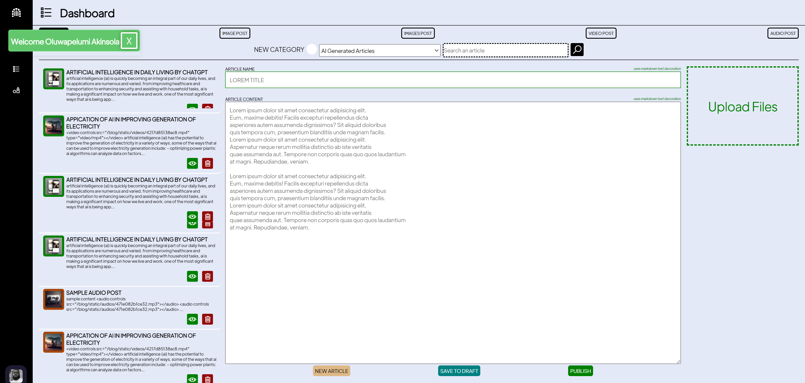

# My Portfolio Blog


This project was created as a simple easy to use resume website with a blog with specific emphasis on using a black background which is actually a personal preference while also ensuring cross platform compatibility for the blog readers. It was built using flask which makes it very light weight in fact my personal version [Akinsola Adefolahan](https://www.adefolahanakinsola.com) is hosted on a 1gb ram instance.

:star: Star us on GitHub — it motivates us a lot!


## SetUp
You will also need an env file located at app/.env

The contents should be defined as follows
```bash
SQLALCHEMY_DATABASE_URI=sqlite:///blogger.db
SQLALCHEMY_TRACK_MODIFICATIONS=False
IS_PRODUCTION=False

IMAGE_UPLOADS=blog/static/images
VALID_IMAGE_EXTENTIONS=['JPG', 'JPEG', 'PNG']
VALID_AUDIO_EXTENTIONS=['MP3', '3GPP']
VALID_VIDEO_EXTENTIONS=['MP4', '3GP']

DEV_CAPTCHA_PUBLIC=YourCaptchaDevelopmentPublicKey
DEV_CAPTCHA_PRIVATE=YourCaptchaDevelopmentPrivateKey
PROD_CAPTCHA_PUBLIC=YourCaptchaProductionPublicKey
PROD_CAPTCHA_PRIVATE=YourCaptchaProductionPublicKey
SENDINBLUE_API_KEY=YourSendInBlueApiKey

```

With python, pip and git installed

```bash
cd my_portfolio_blog

pip install -r requiements.txt

python3 run_app.py
```

## Create Blogger Account
Visit domain/blog/blogger_create

## Blogger Login
Visit domain/blog/blogger_login


## Blog
Visit domain//view_blog


## Blogger Actions
- Dashboard: Create, Edit, Post and Delete Blog Posts
- Accounts: Create, Delete and Edit Accounts
- Resume: Create, Delete and Edit Resume Contents



The design of the resume was inspired by this [free design](https://www.behance.net/gallery/124889695/Dev-portfolio-website?tracking_source=search_projects%7Cresume+website)

Enjoy!